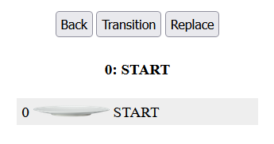
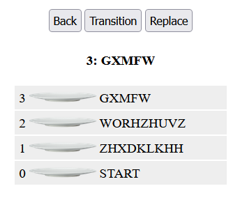

# useVisualMode Visualizer

1. Copy this repo using "Use This Template"

2. Clone your new repo: `git clone <your new new repo url>`

3.  Change to the demo program directory:  `cd <new dir>/visual-mode`

4. IMPORTANT:  Make sure you really did step #3!.  Are you in the `visual-mode` dir?

5. Check again:  `ls -al`  You should see `src` and `public` folders

6. Install the project: `npm install`

7. Start the App:  `npm start`  You will see a dish and some buttons that do nothing :-) 

8. Edit `src/hooks/useVisualMode.js`.  Replace with your `useVisualMode` Hook

9. Add `history` to the returned Object in `useVisualMode`.  Without this the progam will crash

10. If your useVisualMode is working, now the buttons work

11. The bold text is `mode`. If mode is the top dish, your hook is working.   *Did you forget Step 9* ??
